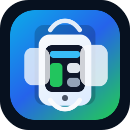

<p align="center">
  
</p>

# Multi-Session-Panel

> A professional desktop automation platform for managing multiple embedded browser panels — with a clean dashboard interface and a modern floating Global Control system.

---

## ✨ Features

| Feature | Description |
|---|---|
| 📱 **Phone Panels** | Polished mobile-device-style browser previews with consistent aspect ratios |
| ⚙️ **Global Control** | Floating utility widget — drag anywhere, always on top |
| 🖱️ **Drag to Reposition** | Pill widget is freely draggable with boundary enforcement |
| 🎯 **Coordinate Capture** | Click any panel to capture exact X/Y coordinates |
| 🔁 **Auto / Repeat Modes** | Automate scroll/click actions across all panels simultaneously |
| 🌗 **Dark & Light Themes** | System-aware with manual toggle |
| 💾 **Persistent State** | Workspace layout, panel order, GC position — all saved to localStorage |
| ⛶ **Fullscreen Mode** | Distraction-free dashboard with all panels maximized |
| 🗂️ **Multi-Profile Browsers** | Chrome, Firefox, DuckDuckGo, Edge — each with an isolated in-app session |

---

## 🗂️ Project Structure

```
panel/
├── package.json                  # Electron app manifest & scripts
├── package-lock.json
├── README.md                     # This file
│
├── src/
│   ├── main.js                   # Electron main process — window, webview lifecycle
│   ├── preload.js                # Secure context bridge (panelApi) exposed to renderer
│   ├── userAgentManager.js       # User-agent rotation logic (JS)
│   ├── userAgentManager.ts       # User-agent rotation logic (TypeScript source)
│   ├── userAgents.json           # Device / browser user-agent database
│   │
│   └── renderer/
│       ├── index.html            # App shell — sidebar, toolbar, GC widget, dashboard grid
│       ├── styles.css            # All layout and visual styles
│       └── app.js                # All renderer-side logic and state management
│
└── .panel-data/                  # Runtime data (created automatically)
    └── ...                       # Browser profiles, session data
```

---

## 🚀 Setup & Run

### Prerequisites

| Requirement | Version |
|---|---|
| Node.js | ≥ 22.12 |
| npm | ≥ 10 |

### Install

```bash
# Clone the repository
git clone https://github.com/dirx-coder/Multi-Session-Panel.git
cd Multi-Session-Panel

# Install dependencies
npm install
```

### Start (Development)

```bash
npm start
```

This launches the Electron app in development mode.

---

## 🏗️ Architecture Overview

```
┌─────────────────────────────────────────────────────────┐
│                    Electron Main Process                 │
│  main.js                                                 │
│  ├── BrowserWindow (app shell)                           │
│  ├── WebContentsView per panel                           │
│  └── IPC handlers: launch, close, reload, globalControl  │
└───────────────────────┬─────────────────────────────────┘
                        │  contextBridge (panelApi)
                        ▼
┌─────────────────────────────────────────────────────────┐
│                  Renderer Process                         │
│  index.html + styles.css + app.js                        │
│                                                          │
│  ┌─────────────┐  ┌───────────────────┐  ┌───────────┐  │
│  │  Sidebar    │  │  Control Toolbar  │  │ GC Pill   │  │
│  │  Workspaces │  │  URL Editor       │  │ (Floating)│  │
│  └─────────────┘  └───────────────────┘  └───────────┘  │
│                                                          │
│  ┌─────────────────────────────────────────────────────┐ │
│  │              Dashboard Grid                          │ │
│  │  ┌──────────┐  ┌──────────┐  ┌──────────┐  ...     │ │
│  │  │ Panel 1  │  │ Panel 2  │  │ Panel 3  │           │ │
│  │  │ Chrome   │  │ Firefox  │  │ Edge     │           │ │
│  │  └──────────┘  └──────────┘  └──────────┘           │ │
│  └─────────────────────────────────────────────────────┘ │
└─────────────────────────────────────────────────────────┘
```

---

## 🎮 Controls

### Global Control Widget (GC)

The **GC pill** floats in the bottom-right corner (default). It is always on top.

| Interaction | Action |
|---|---|
| **Click pill** | Expand / collapse the GC control panel |
| **Drag pill** | Reposition anywhere inside the app window |
| **▲ Up / ▼ Down** | Scroll all panels simultaneously |
| **Double Click** | Send a double-click at the current pointer position |
| **Stop** | Cancel any ongoing scroll action |
| **Auto mode** | Auto-repeat the last action on a timer |
| **Repeat mode** | Execute action N times with a set delay |
| **Concurrent** | Run actions on all panels at the same time |
| **Capture Coordinates** | Hover over a panel to preview X/Y; click to capture |

### Panel Grid

| Interaction | Action |
|---|---|
| **Click panel** | Select (single) |
| **Ctrl/⌘ + Click** | Multi-select |
| **Double-click panel** | Fullscreen the panel |
| **Drag panel** | Reorder panels within the grid |
| **Ctrl/⌘ + R** | Reload selected or all panels |
| **Ctrl/⌘ + L** | Launch workspace (Start All) |
| **Escape** | Exit fullscreen panel |

---

## ⚙️ Toolbar Reference

### Action Controls
- **Start All** — Launch all panels with their configured URLs
- **Reload Selected** — Reload only checked panels
- **Close All** — Destroy all embedded views (sessions preserved)
- **Refresh All** — Force-reload all visible panels
- **Delete Selected** — Permanently remove selected panels from the workspace

### Tab Controls
- **Tabs** — Number of tabs to create
- **Mode** — `Append` (add to existing) or `Replace` (close all first)
- **Create Tabs** — Spawn panels with the configured browser + URL
- **Fullscreen** — Toggle distraction-free mode
- **Light/Dark Mode** — Toggle theme

### Layout Controls
- **Auto Arrange** — Automatically compute rows from column count
- **Compact View** — Use mobile viewport dimensions
- **Rows / Columns** — Manual grid dimensions
- **Scale** — Resize all panels proportionally
- **Save / Load Layout** — Persist or restore grid configuration

---

## 💾 Persistence

| Key | Contents |
|---|---|
| `panel-workspace-state-v1` | All workspaces, panel order, URLs, grid settings |
| `panel-workspace-theme` | `"dark"` or `"light"` |
| `panel-workspace-ui-v1` | Sidebar/controls collapsed state |
| `panel-gc-position-v1` | Last GC widget position `{left, top}` |

All data is stored in **Electron's renderer localStorage** — no external server required.

---

## 🔒 Security Notes

- The renderer runs in an isolated context; all Electron APIs are exposed via `preload.js` through `contextBridge`.
- No `nodeIntegration` in the renderer — the `panelApi` surface is the only IPC bridge.
- Each browser profile (`chrome-1`, `firefox-2`, etc.) uses an isolated Chromium session partition.

---

## 🧪 Verify Before Publishing

```bash
npm run check
```

Runtime browser data is written to `.panel-data/`, which is intentionally ignored by Git.
